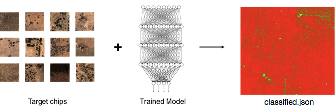

# deploy-chip-classifier

A GBDX task to deploy a trained [Keras](https://keras.io/) classifier on a set of target image chips. The task returns a json file 'classified.json', which contains the input chip names, each with a classification result and confidence score. Note that if the model was trained using a Theano [backend](https://keras.io/backend/) the deploy-chip-classifier-theano task name should be used.



## Run

Here we run though a sample execution of the deploy-chip-classifier task. We will be deploying a model that classifies chips in Africa as 'No Buildings' or 'Buildings'. All of the input data is available in the S3 locations specified below.

1. Within an iPython terminal create a GBDX interface and specify the task input location:

    ```python
    from gbdxtools import Interface
    from os.path import join
    import uuid

    gbdx = Interface()

    input_location = 's3://gbd-customer-data/32cbab7a-4307-40c8-bb31-e2de32f940c2/platform-stories/deploy-chip-classifier/'
    ```

2. Create a task instance and set the required [inputs](#inputs):

    ```python
    deploy_task = gbdx.Task('deploy-chip-classifier')
    deploy_task.inputs.model = join(input_location, 'model')
    deploy_task.inputs.chips = join(input_location, 'chips')
    ```

3. Specify the classes for the deploy task. We can also specify the size of the chips:

    ```python
    deploy_task.inputs.classes = 'Buildings, No Buildings'
    deploy_task.inputs.size = '224'
    ```

4. Initialize a workflow and specify where to save the output:

    ```python
    deploy_wf = gbdx.Workflow([deploy_task])
    random_str = str(uuid.uuid4())
    output_location = join('platform-stories/trial-runs', random_str)

    deploy_wf.savedata(deploy_task.outputs.results, join(output_location, 'classified_json'))
    ```

5. Execute the workflow:

    ```python
    deploy_wf.execute()
    ```

6. Track the status of the workflow as follows:

    ```python
    deploy_wf.status
    ```


### Input Ports

The following table lists the input ports of deploy-chip-classifier. Note that booleans, integers and floats **must be** passed to the task as strings, e.g., 'True', '10', '0.001'.

| Name | Valid Values | Description | Required |
|------|--------------|-------------|----------|
| chips | Directory | Contains the chips to deploy on in a single tar file. Acceptab le chip image format include jpeg, tif and png. | True |
| model | Directory | Contains an h5 file with the model trained using a tensorflow backend. If a Theano backend was used, please use the deploy-chip-classifier-theano task. | True |
| classes | String | The classes to sort each chip into. Different class names should be separated by commas and must be in the same order that the model was trained on (e.g- 'No Buildings, Buildings'). If this is omitted the classes will be numerical. | False |
| size | String | Chip size in pixels. If a chip has a different size, it is automatically resized to (size)x(size). Default is 224. | False |
| deploy_batch | String | Size of deploy batch. Default is 100. | False |
| normalization_vector | String | Pixel intensity values to subtract from R, G, B bands. The default is '123.68,116.779,103.939'. | False |
| normalization_value | String | Pixel intensity values to divide chips by. Division will take place after subtracting the normalization_vector. Defaults to None. | False |


## Output Ports

deploy-chip-classifier has two outputs as detailed below.

| Name  | Type | Description:                                      |
|-------|------|---------------------------------------------------|
| results | Directory | Contains classified.json, which has chip names as a keys and results as values. Results include identified class name and certainty in the classification. |
| logs | Directory | Contains out.log. out.log includes information on the time required to load the model and the total classification time. |


## Advanced

### Chip size

The Keras classifier expects height and width of each chip to be equal. Therefore, if an input size is specified, all channels of each chip will be warped to that dimension. Note that if target chips are not the same shape as the input layer of the model the size must be specified.

### Backend

The deploy-chip-classifier task assumes that the model was trained using a Tensorflow backend. If you wish to deploy a model trained with a Theano backend, simply use the task name ```deploy-chip-classifier-theano``` with otherwise the same configuration.

### Data preprocessing

This task preprocesses the data before deploying. It reformats all chips from RGB to BGR, and subtracts the mean intensity (as specified by the normalization_vector input) from each band. The model should be trained using the same preprocessing technique. Note that many publicly available models (including resnet50 and VGG Net) are trained this way.

### Tar format

The chips input directory should contain one tar file of all the chips. To create this from a directory of chips simply use the following command:  ```tar -cvf <directory_name>.tar <directory_name>```. Note that the name of the tar file must match the name of the directory for this task.

## Development

### Build the Docker Image

You need to install [Docker](https://docs.docker.com/engine/installation/) and [NVIDIA Docker](https://github.com/NVIDIA/nvidia-docker), and run the task on a GPU.

Clone the repository:

```bash
git clone https://github.com/platformstories/train-chip-classifier
```

Then:

```bash
cd deploy-chip-classifier
docker build -t deploy-chip-classifier .
```

### Try out locally

Create a container in interactive mode and mount the sample input under `/mnt/work/input/`:

```bash
docker run `curl -s http://localhost:3476/v1.0/docker/cli` -v full/path/to/sample-input:/mnt/work/input -it deploy-chip-classifier
```

Then, within the container:

```bash
python /deploy-chip-classifier
```
Watch progress of stdout to ensure task is running.


### Docker Hub

Login to Docker Hub

```bash
docker login
```

Tag your image using your username and push it to DockerHub:

```bash
docker tag deploy-chip-classifier yourusername/deploy-chip-classifier
docker push yourusername/deploy-chip-classifier
```

The image name should be the same as the image name under containerDescriptors in deploy-chip-classifier.json.

Alternatively, you can link this repository to a [Docker automated build](https://docs.docker.com/docker-hub/builds/). Every time you push a change to the repository, the Docker image gets automatically updated.


### Register on GBDX

In a Python terminal:

```python
from gbdxtools import Interface
gbdx = Interface()
gbdx.task_registry.register(json_filename='deploy-chip-classifier.json')
```

Note: If you change the task image, you need to reregister the task with a higher version number in order for the new image to take effect. Keep this in mind especially if you use Docker automated build.
